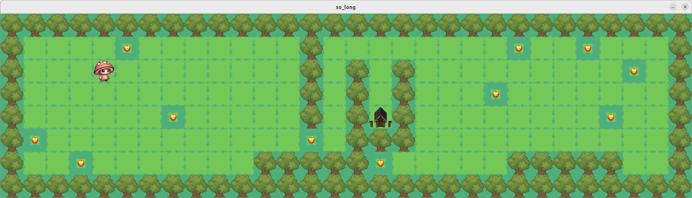

# Usage and installation
To play this simple game run the following:
```
git clone git@github.com:JOAOVIEG/So-long.git so_long
cd so_long
cd minishell
make && ./so_long maps/valid/map1.ber
```
Use W, A, S, D for Player movement.

You can try different maps!


# Game Description and plot
This project is about creating a simple 2D game, dealing with textures, sprites and very basic gameplay elements  such as window management and event handling, using the Minilibx library.

The many maps available all have one thing in common: a Player, Collectibles an Exit and Walls.
The purpose of the game is to have the Player collect all the tokens before exiting and in any possible path. The amount of moves are displayed in the terminal. 
He then shouts "So long!!"
